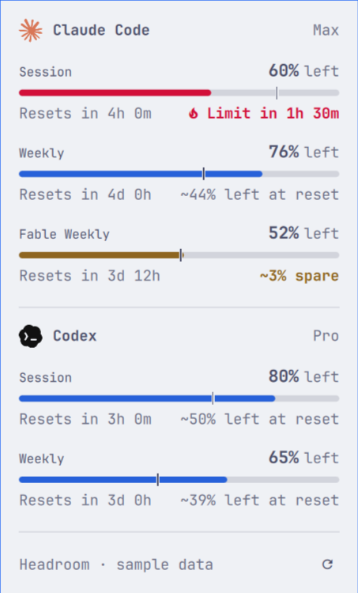
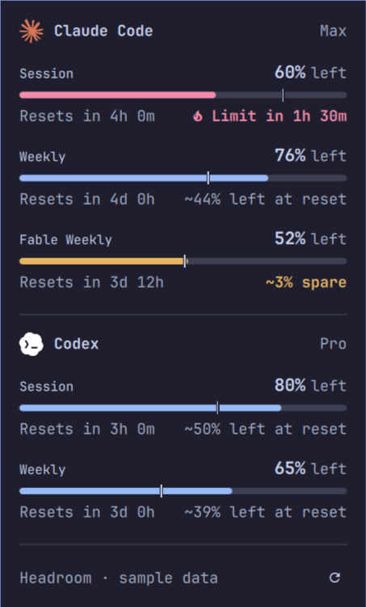

# Headroom

Claude Code and Codex quota percentages, reset times, and usage forecasts for the Omarchy bar.

**Early proof of concept.** Both providers stay visible in the bar and in one compact panel. Headroom follows Omarchy's native styling and uses its installed usage collectors.

## What it shows

- Session and weekly percentages **remaining**, labeled S and W in the bar.
- Session, weekly, and reported model-specific quota windows in the panel.
- Reset countdowns and a marker for the allowance expected to remain at an even pace.
- Projected capacity left at reset, an amber spare-capacity warning, or a flame with estimated time to exhaustion.
- Last-known percentages with a warning when a refresh cannot be verified. Unreliable data never generates a forecast.

Forecasts use average consumption since the quota window began. They are estimates of allowance consumption, not additional charges or a measurement of the last few minutes' activity.

## Preview

Synthetic values; the interface follows the active Omarchy theme.


| Light | Dark |
| --- | --- |
|  |  |

## Requirements

- Omarchy with the Quattro shell, native plugin services, and `omarchy-agent-usage-claude` / `omarchy-agent-usage-codex` collectors.
- Python 3 and signed-in Claude Code / Codex CLIs.

## Install

```sh
omarchy plugin add https://github.com/steveclarke/omarchy-headroom.git --enable
```

Click the bar summary to open the panel. Right-click or middle-click refreshes; R or Enter refreshes inside the panel, and Escape closes it. Usage refreshes every five minutes. Repeated refresh requests within twenty seconds are coalesced.

Once satisfied with Headroom, disable the built-in Agents display to avoid two independent refresh loops:

```sh
omarchy plugin disable omarchy.agents
```

To restore the built-in display:

```sh
omarchy plugin remove io.github.steveclarke.headroom
omarchy plugin enable omarchy.agents
```

Update with `omarchy plugin update io.github.steveclarke.headroom`.
If an update still shows the old behavior, run `omarchy restart shell` to clear the shell's compiled QML cache.

## Current limitations

- Headroom shows only windows exported by Omarchy's collectors. A provider can legitimately have a weekly allowance without a shared session allowance; S then reads `—`. The current Codex collector does not export its separate model-specific pools.
- Forecasts require a known window duration and a verified recent observation. Unknown windows still show their usage and reset time. A new or unused window has no meaningful burn rate yet.
- Claude can silently fall back to cached values. Headroom checks the native usage-cache timestamp to detect this. A simultaneous check by another widget can temporarily leave Claude marked unverified; retry after twenty seconds. The native CLI owns login renewal.
- There is one active account per provider. Headroom does not persist its own snapshots or support account switching/multi-account aggregation.
- Native collectors may scan local history when their caches expire, although Headroom discards those statistics and displays only quota windows.
- This proof of concept targets horizontal bars. Vertical layout is provisional.

## Development

The shell creates one `Service.qml` for all monitors. It runs `bin/headroom-collect`; `Model.js` and `Pace.js` normalize display state and calculate forecasts. `BarWidget.qml` hosts the native `Panel.qml` lifecycle.

Interface conventions are recorded in [DESIGN.md](DESIGN.md).

Run the checks with Node.js, Python 3, Qt 6 qmllint and Omarchy installed:

```sh
python3 bin/check
```

For runtime checks on an installed plugin:

```sh
omarchy-shell headroom status
omarchy-shell shell summon io.github.steveclarke.headroom '{}'
omarchy-shell shell hide io.github.steveclarke.headroom
```

Synthetic previews exercise forecasts, errors and empty states without provider calls. The footer always identifies sample data. Return to live mode when finished:

```sh
omarchy-shell headroom preview normal
omarchy-shell headroom preview stale
omarchy-shell headroom preview empty
omarchy-shell headroom preview ''
```

Use synthetic fixtures and screenshots. Never commit credentials, account identifiers, local usage records, or machine configuration. Only fixed error categories are surfaced; raw collector output is not logged. The read-only status command reports state and window counts, not usage amounts.

## License

MIT. See [LICENSE](LICENSE) and [NOTICE](NOTICE) for upstream attribution.
